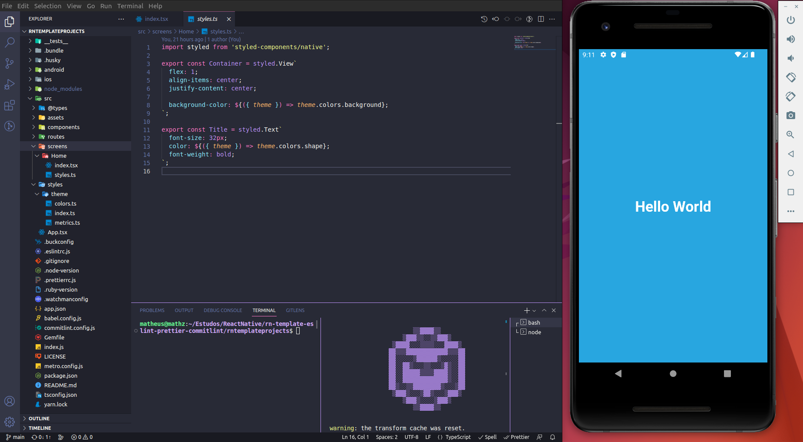
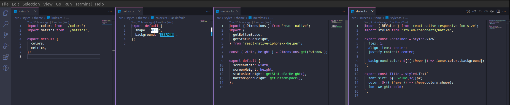
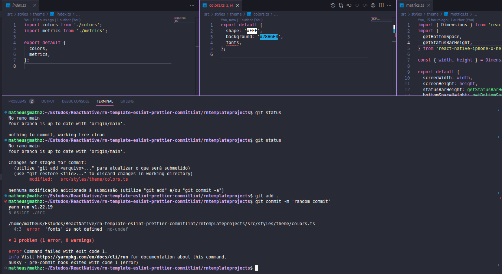
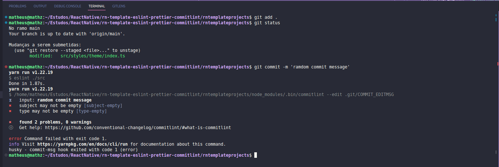
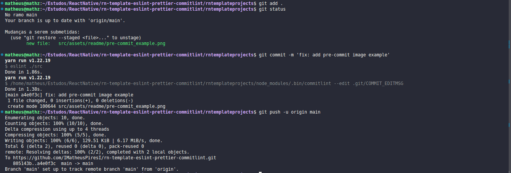

# Template for REACT NATIVE CLI projects

  

##  TECHNOLOGIES

<ul>
  <li>
    
React Native CLI

  </li>
  <li>
    
TypeScript

  </li>
  <li>
    
Styled-Components

  </li>
  <li>
    
react-native-responsive-fontsize

  </li>
  <li>
    
Eslint

  </li>
  <li>
    
Prettier

  </li>
  <li>
    
Husky

  </li>
  <li>
    
lint-staged

  </li>
  <li>
    
commit-conventional / commitlint

  </li>
  <li>
    
react-native-iphone-x-helper

  </li>
</ul>

##  PROJECT PRE-SETTINGS

###  -> Theme Styled-Components

  

<ul>
  <li>
    
 -> The index file will compose our theme variable added to ThemeProvider in the App root.

  </li>
  <li>
    
 -> The colors file is responsible for storing all the colors defined for the project.

  </li>
  <li>
    
 -> The metrics file is responsible for storing some metrics settings that are frequently used in the construction of the project, such as the height and width of the App and the StatusBar.

  </li>
  <li>
    
 -> Because fonts are something very personal to each project, I preferred not to add a default to the project, but if you want to add it, just create the fonts file and add it to the theme after configuring it with the desired font.

  </li>
  <li>
    
 -> In the example styles file, we have what the use of the theme in styled-components would look like, along with the responsive-fontsize.

  </li>
</ul>

###  -> Pre-commit / lint-staged

  

<ul>
  <li>
    
 -> This configuration of commits serves to preserve the quality of the code, and of the commits sent to the repository.

  </li>
  <li>
    
 -> In the above case, a change would be committed that has an error found by eslint. Therefore, when trying to commit a change, the eslint command is triggered, checking all the code, if an error is found, it will warn and prevent the commit until it is fixed.

  </li>
</ul>

###  -> Commit-msg

#### Fail commit

  

<ul>
  <li>
    
 -> In the above case we can see the commit-msg in action. Basically it standardizes project commits, thus avoiding random commits, without types like "fix: message", "feat: message". Thus improving the quality of project commits.

  </li>
  <li>
    
 -> If we look at the commit message, we will see "randon commit", that is, it doesn't have a pattern, something that identifies what that commit is based on, a fix or a feature.

  </li>
  <li>
    
 -> When we look at the error message, it tells us exactly what is missing for the commit approval, even giving the source for a better understanding of the patterns.

  </li>
</ul>

#### Success commit

  

<ul>
  <li>
    
 -> In the above case, we have the commit success. When using the correct patterns, typing the commits for semantic sense will allow the commit to be sent.

  </li>
  <li>
    
 -> We can see that before the commit is approved, it runs eslint looking for an error in the code, then it runs commitlint looking for errors in the commit message, and if everything is approved, it allows the commit to be performed, thus making the code more safe.

  </li>
</ul>

